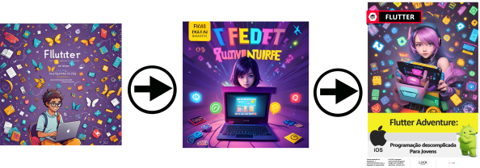
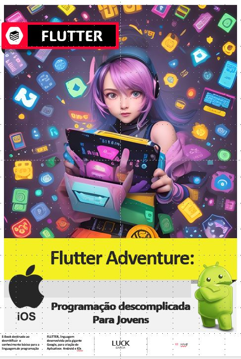

    

# IA Prompts 
## Este repositório trata-se de desmitificar os prompts para insights de Inteligência Artificial

-----
A teoria por traz dos prompts, foi me exemplificado atraves da prataforma [DIO.me](https://dio.me/)

## Alguns prompts utilizados nos curso

### Na trilha --> PROMPT ASSERTIVOS
---

MODELOS DE PERGUNTAS COM O PODER DA FANTASIA COMPUTACIONAL

### Prompt com a tecnica FTAE

Me [FUNÇÃO] um [TIPO DE TEXTO] sobre [ASSUNTO] nesse [ESTILO]:

Onde:
- FUNÇÃO: (escreva / resuma / traduza / crie tópicos )
- TIPO DE TEXTO: (roteiro / post para blog /artigo / poema / postagem para o instagram )
- ASSUNTO: (i.a /futebol / música / filme / ....etc )
- ESTILO: (personalidade / escritor / filósofo / cantor )

### USANDO A TÉCNICA
---
PROMPT A SER DGITADO NO CHART GPT

me [escreva] em formato de [post do instagram], uma postagem sobre [programação com os
principais comandos javascript] em um estilo, [informal e descontraido, como se fosse
um influencer de tecnologia]

---
---

Prompt com a tecnica 3R (Usando campos semânticos e variavéis)
- RESUMO
- ROTEIRO
- REGRAS

### USANDO A TÉCNICA DE ROTEIRO
----
PROMPT A SER DGITADO NO CHART GPT

Me escreva um artigo sobre primeiros passos no docker, em tom de conversa com uma criança de 14 anos.
Agora use os itens em {RESUMO} para o {ROTEIRO} seguindo as {REGRAS}

{RESUMO}
[autoridade]: Felipe um desenvolvedor fullstack
[avatar]: desenvolvedores juniors
[problema]: como instalar o docker

{ROTEIRO}
Olá eu sou a [autoridade] e vou ajudar o [avatar]
Hoje vamos resolver o [problema]

{REGRAS}
>Siga o {ROTEIRO} acima e substitua os elementos entre [ ] por aqueles listados em {RESUMO} acima.
>Matenha o tom e o ritimo, mas reescreva as palavras em {ROTEIRO} para que sejadiferente da original
expandindo e mudando conforme necessário.
>Use analogia simples e hiperboles.

### USANDO A TÉCNICA DE ACT PROMPTS
---
Voce vai pedir para que o ChartGPT se comporte como alguma "Pessoa", ator, personagem etc
Para o principal comando seria:
--> AJA OU ATUE, COMO [AUTORIDADE/FERRAMENTA/PERSONAGEM]

EXEMPLOS:
- Aja como o imperador romano Julio Cesar, e me reponda as proximas perguntas.
- Atue como um console Java script, e me retorne as proximas perguntas
- Atue como [Dath Vader] de (gerra nas estrelas)

ATUAÇÃO COM REGRAS:

- Atue como se fosse um [especialista de flutter sênior], que me esta orientando a programar mais facilmente
{REGRAS}
>Sempre que eu lhe informar o que estou fazendo, faça um checklist resumido de boas praticas para a tarefa
>Sempre que eu lhe informar o que estou fazendo, ao final me envie uma sugestão de código

---
---

    

## Projeto EBOOK Gerado por I.A.s

Projeto com o objetivo de gerar um ebook digital com as facilidades das ferramentas de IA. todos os prompts
seguem abaixo.
---
### 💻 Tecnologias utilizadas no projeto

- [ChatGPT](https://chat.openai.com/) 
- [MidJourney](https://www.midjourney.com/app/)
- [PowerPoint](https://www.microsoft.com/en/microsoft-365/powerpoint)

### 1) Vamos utilizar prompts para gerar um e-book

### 2) Utilizando do ChatGPT vamos ao prompt de conversa e gerando primeiramente nosso título chamativo

### 3) Meu prompt para gerar o título

Crie um título épico e curto para um e-book, onde o tema principal deste e-book seria um passo a passo desde a instalação até programação básica na linguagem Flutter, com uma didática com foco em adolescentes, sendo algo "gameficado" e realmente fácil de aprender. Sendo assim, me gere 10 títulos curtos para este e-book.

### 4) Segue os 10 títulos gerados:

Claro, aqui estão 10 títulos épicos e curtos para o seu e-book sobre programação básica em Flutter com uma abordagem gamificada e focada em adolescentes:

1. **"Flutter Quest: Jornada de Código para Teens"**
2. **"Flutter Heroes: Código Fácil e Divertido"**
3. **"Epic Flutter: Do Zero ao Código em Ação"**
4. **"Flutter Adventure: Instale, Codifique, Jogue"**
5. **"Code Masters: Aventura em Flutter para Jovens"**
6. **"Flutter Legends: Programação Descomplicada"**
7. **"Teen Coders: A Saga do Flutter"**
8. **"Flutter Kingdom: Conquiste o Código"**
9. **"Epic Code: Aventura Flutter para Adolescentes"**
10. **"Flutter Odyssey: Explore e Codifique"**

Espero que um desses títulos atenda às suas expectativas!

### 5) O título escolhido foi 
**Flutter Adventure: Instale, Codifique, Jogue**

### 6) Gerando o prompt para a IA desenvolver o e-book

Faça um texto para o e-book "Flutter Adventure: Instale, Codifique, Jogue", com foco totalmente em Flutter nível básico, listando a instalação no VSCode até a criação de um jogo bem simples de no máximo duas telas, visando o leitor a conseguir conhecimento no e-book para concluir passo a passo a programação deste jogo simples.

{REGRAS}
> Explique sempre de maneira simples  
> Deixe o texto enxuto  
> Sempre traga exemplos de códigos em contextos reais  
> Crie um título sugestivo por tópico

### 7) Gerando o prompt para a IA codificar em linguagem Flutter um jogo da velha

Abaixo envio um Código comentado sobre como criar um Jogo da Velha em Java, gostaria de implementar o mesmo jogo, no ebook, porem logicamente em flutter, separar o conteúdo do passo a passo em 5 capitulos

(codigo)

### 8) Diagramação com power point, utilando de recursos que poucos conhecem

Foi feita a diagramação de todo o e-book com o mricrosoft power point, sei que existe ferramentas com caracteristicas melhores para esta tarefa.

Mas usar o power point para esta tarefa demorou apenas 40 minutos, e fiquei feliz com o resultado.

    

## ✨ Features

- Conteúdo gerado via ChatGPT
- Imagens geradas via MidJourney

## 📚 Materiais

- Imagens utilizadas em `assets`
- ebook gerado durante as aulas em `output`

## 🛠️ Instruções de execução

Utilize os prompts acima nas ferramentas sugeridas para gerar o material base e utilize uma ferramenta de edição de documentos como power point, libreoffice , indesign para diagramação.

## 📚 Documentação originadas de meus insights 

- [x] Arquivo do E-Book no formato Power Point editável <a href="https://github.com/lucksgarcia/IA_prompts_create_ebook/output/FLUTTER ADVENTURE_Ebook.pptx">📕Clique aqui para baixar</a>
- [x] E-Book em formato pdf, para leitura e aprendizado <a href="https://github.com/lucksgarcia/IA_prompts_create_ebook/output/FLUTTER ADVENTURE_Ebook.pdf">📕Clique aqui para Ler</a>

### Gostou do que aprendeu? e lhe ajudei em algo, sinta-se a vontade e me pague um ☕ [cafezinho pix](d5c5d889-b8e3-46b9-8b66-83f3e96f2001)

